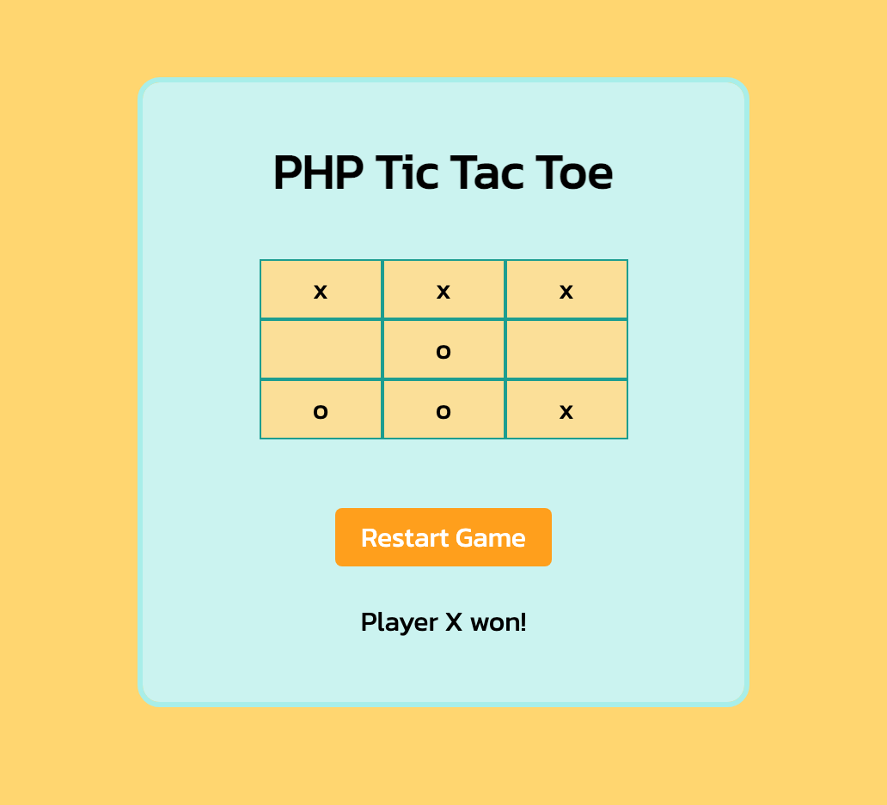

## PHP Tic Tac Toe

I built a Tic Tac Toe game using only PHP, HTML, and CSS. Each player enters either 'x' or 'o' and then clicks the `Complete Turn` button. Players are prevented from entering other characters and are presented with a button to `Restart Game` when either player wins or when the turns taken total to nine without a winner. 

### Screenshot

 

### Setup

- Install [Docker](https://docs.docker.com/desktop/install/mac-install/) 
- Run `docker-compose build` then `docker-compose up` in terminal. 
- Access in the browser at http://localhost:8000/

